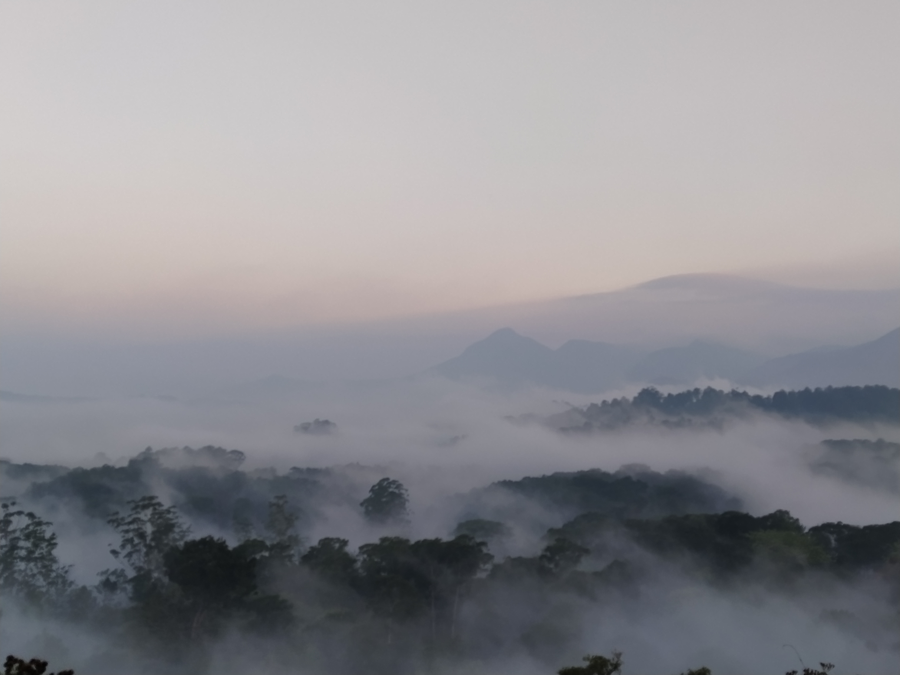

### Hello! 👋

I am an avian ecologist studying the community ecology of birds along tropical mountains. My research encompasses the fields of bioacoustics, historical ecology and citizen science (Please see links to different projects below). 

### Citizen Science

This study uses data from eBird to parse climatic and land cover influences on bird occupancy within a tropical biodiversity hotspot (*In review*). 

### Bioacoustics

I analyze acoustic data across sites from the Western Ghats to explore patterns of species diversity and acoustic space use (*In prep*). Listen to a recording of the dawn chorus from the Western Ghats 

### Conservation Funding

Using a large database of grants awarded for biodiversity conservation, our study shows that conservation funding does not track the drivers of biodiversity loss (*In review*)
